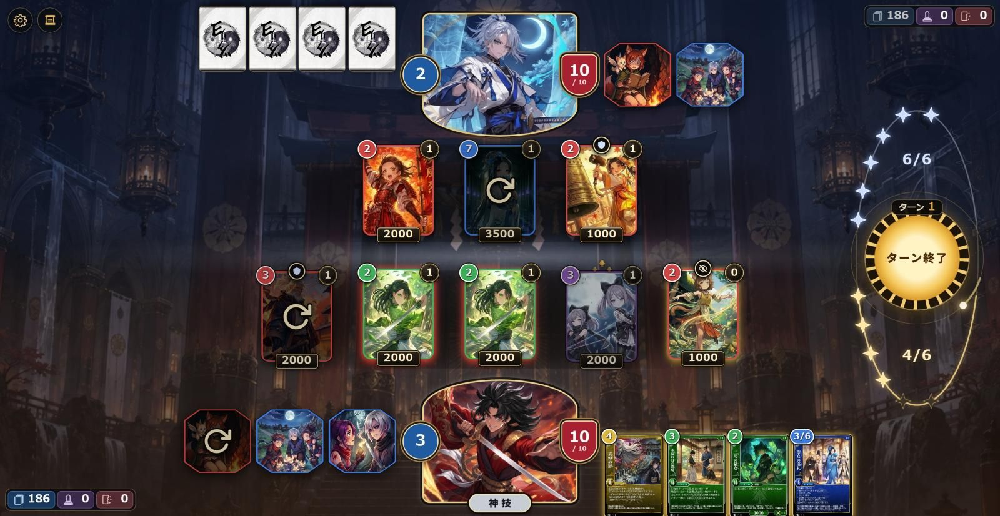

# 星戦画面（新しい配置）素材の依頼まとめ

新しい配置の試作で、仮の図形（CSS・SVG）で描いている部品を、ChatGPTで作る素材に置き換えるための整理です。

- 依頼文と生成指示（貼り付け用）：同じフォルダの `CHATGPT_PROMPT.md`
- 現在の画面：`reference/` の3枚（1920×993で撮影）
  - `current-layout-1920x993.png`：自分のターンの盤面全体
  - `right-column-opponent-turn.png`：相手のターンの右の列（月輪）
  - `kami-window-closeup.png`：自分のカミの窓のまわり

## 1. 現状

### 試作の場所

- ブランチ `claude/battle-layout-v2`（未コミット）。本番には反映していない。
- 対戦画面で新しい配置になる。左上の設定メニューの「従来の配置」で元の画面に戻せる（端末に記録）。
- 確認用：`npm run preview` → http://localhost:8765/index.html

### 構図

大きさはすべて画面の高さに比例する（下の寸法は1920×993で測った値）。

| 場所 | 中身 |
| --- | --- |
| 中央の縦軸 | 相手のカミ（上端、窓の下側がアーチ）と自分のカミ（下端、窓の上側がアーチ）。窓はどちらも315×238（額縁の素材の窓と同じ縦横比） |
| カミの窓の左右 | 左の縁に天力の紋（ヤマタノオロチは封印）70px、右の縁にライフ70×79 |
| 自分のカミの窓の下 | 神技の札 119×36（相手には無い） |
| 中央の2段 | レガシー（上が相手、下が自分）。札136×174、最大7枚 |
| 斜めの対（点対称） | 相手の伏せ札＝左上、相手のレリック・山札等＝右上／自分の手札＝右下、自分のレリック・山札等＝左下 |
| 右の列 | 渾天儀（星の観測器）258×755。中央の円盤＝ターン終了、上の弧＝相手のマナ、下の弧＝自分のマナ |
| 左上 | 設定（歯車）とバトルログの丸ボタン48px。カーソルを合わせたカード・カミの情報欄もここに出る |

### 決まっている方針

- 「自分の場」「相手の場」のような文字のラベルは置かず、形と色で伝える。数字と最小限の文字（「ターン終了」「神技」など）はゲーム側で重ねる。素材には文字・数字を入れない。
- 装飾は和風。画風は「黒漆に細い金線で描く、控えめな蒔絵」：艶を抑えた平らな塗り、細く均一な線、広い余白。金ピカのグラデーション・浮き彫り・重厚な金具・玉・家紋のような飾り（水戸黄門のような印象）は使わない（初回の素材を見てユーザーが判断、2026-10-08）。
- 光らせる演出はゲーム側で「今押せるもの」だけに付ける。素材そのものは光らせない。
- 盤面の数字とラベルは明朝体（游明朝・ヒラギノ明朝）。極太のゴシックは安っぽく見えるため。
- 自分の側は日・金・暖色、相手の側は月・銀青・寒色。
- シャドウバースに似せない。右の列は3つの箱（マナ・ターン終了・マナ）を並べず、ひとつの道具（渾天儀）にした。丸いボタンのまわりの輪が減っていくタイマーは使わない。
- 地面は相手側を青く冷たい色味、自分側を温かい色味にし、境目は線を引かずに霧でぼかす（しめ縄はやめた）。

### 各部品の今の見た目

| 部品 | 画面での大きさ | 今の作り | 素材にするか |
| --- | --- | --- | --- |
| ターン終了の円盤（日輪／月輪） | 直径199px | 初回の素材を仮に使用中。手番が変わると裏返る | する（1・2、作り直し） |
| マナの星 | 30px×10個×上下 | SVGのひし形の四芒星（使える・使った・空き・最大超え） | しない（素材の星よりこちらがよいとユーザーが判断） |
| カミの窓の額縁 | 315×238 | 初回の素材（金具の多い額縁）を仮に使用中 | する（4、作り直し） |
| 神技の札 | 119×36 | 初回の素材を仮に使用中。使えない＝黒、神技が使える＝銀、創世神技が使える＝金 | する（5、作り直し） |
| 天力の紋・封印の紋 | 70px | 青い丸に数字（オロチは赤） | する（6・7） |
| ライフ | 70×79 | 赤い盾の形に数字 | する（8、御守りの形を提案） |
| 戦闘力・ターン数の札 | 81×28、99×30 | 黒地に金の縁の札 | する（9、共用） |
| 神攻力の丸 | 36px | 黒漆と金の丸 | する（10） |
| タップの印 | 約60px | SVGのくるっと回る矢印 | する（11） |
| ワード効果の紋（守護など6種） | 32pxの丸の中 | 既存の線画アイコン | する（12、SVG） |
| 左上の丸ボタンの台座 | 48px | 黒地に金の縁 | する（13） |
| 渾天儀の環・弧・時間の環と流れ星 | 列全体 | SVGの線 | しない（下の表） |

ライフは盾のままだと西洋の印象が強いので、和風の御守りの形を提案しています。盾のままにしたい場合は、`CHATGPT_PROMPT.md` の8の形の指定を差し替えてください。

### 素材にしない部品（コードのまま）

| 部品 | 理由 |
| --- | --- |
| 場の札の属性の色の枠・マナの丸（手札も） | 7色（赤・青・緑・黄・紫・無・創）を切り替えるため |
| 行動できるレガシーの金・赤の光、使える手札の金の光 | 状態で点けたり消したりするため |
| 渾天儀の環・弧、時間の環と流れ星の尾 | 星の位置をマナの数から計算しているため。絵にすると位置が合わなくなる |
| 数字と文字（マナの数・戦闘力・ターン数・「ターン終了」「神技」など） | 値が変わるため。読みやすさのため |
| 地面の色味・境目の霧 | どの場の背景でも同じように効かせるため（霧は任意で素材にしてもよい） |
| 押せない・暗くする状態 | 素材に色の変化を付けて表す |
| 山札・墓地・崩壊、設定・バトルログのアイコン | 既存の素材を使用中 |

## 2. 素材一覧

優先度1から順に依頼する。納品サイズは、4K画面（表示が約2.2倍）でもぼやけない大きさにしている。ゲームへの組み込み（WebP化・ハッシュ付きの名前・`version.js` の更新）は Claude Code が行う。

| # | 素材 | 状態・枚数 | 画面での大きさ | 納品ファイル（透過PNG） | 取り込み | 優先度 |
| --- | --- | --- | --- | --- | --- | --- |
| 1 | 日輪の円盤（自分のターン・ターン終了） | 1 | 直径199px | `sun-disc.png` 720×720 | sprite | 1 |
| 2 | 月輪の円盤（相手のターン） | 1 | 直径199px | `moon-disc.png` 720×720 | sprite | 1 |
| 3 | （マナの星） | — | — | 作らない（コードの四芒星に決定） | — | — |
| 4 | カミの窓の額縁（相手は上下反転して使う） | 1 | 315×238 | `kami-frame.png` 720×576 | sprite | 1 |
| 5 | 神技の札 | 3状態 | 119×36 | `skill-tab-off.png` `skill-tab-silver.png` `skill-tab-gold.png` 各360×108 | sprite | 1 |
| 6 | 天力の紋（台座） | 1 | 70px | `tenryoku-plate.png` 256×256 | sprite | 2 |
| 7 | 封印の紋（ヤマタノオロチ用） | 1 | 70px | `seal-plate.png` 256×256 | sprite | 2 |
| 8 | ライフの台座（御守りの形） | 1 | 70×79 | `life-plate.png` 256×256（縦長の形を中央に） | sprite | 2 |
| 9 | 黒漆の札（戦闘力・ターン数で共用、横に伸ばす） | 1 | 81×28〜99×30 | `lacquer-plaque.png` 480×160（左右の端72pxずつが飾り） | sprite | 2 |
| 10 | 神攻力の丸 | 1 | 36px | `attack-medallion.png` 160×160 | sprite | 2 |
| 11 | タップの印 | 1 | 約60px | `tap-mark.png` 192×192 | sprite | 3 |
| 12 | ワード効果の紋（守護・死角・呪殺・奇襲・疾駆・拘束） | 6 | 32pxの丸の中 | 各SVG（currentColor）＋各PNG 128×128 | SVGをインライン化 | 3 |
| 13 | 左上の丸ボタンの台座 | 1 | 48px | `round-button-base.png` 192×192 | sprite | 3 |
| 14 | 渾天儀の背面の星図 | 1 | 直径約360px | `orrery-star-chart.png` 720×720 | sprite | 任意 |
| 15 | 境目の霧 | 1 | 横幅約1100px | `mist-band.png` 1600×400 | scene | 任意 |
| 16 | 召喚酔いのひよこ（今は絵文字🐥） | 1 | 16px | `piyo.png` 128×128 | sprite | 任意 |

## 3. 進め方

1. 優先度1を ChatGPT に依頼する。初回（`design_assets/battle-layout-v2-parts-v1/`）は画風が合わなかったため、新しい画風で4点（日輪・月輪・額縁・神技の札）を作り直す（`CHATGPT_PROMPT.md` の「バッチ1・作り直しの依頼文」）。
2. 届いた素材を Claude Code が試作に組み込み、実際の画面で確認する。直しが必要なら追加で依頼する。
3. 優先度2（バッチ2）、優先度3（バッチ3）を同じ流れで進める。任意の素材は全体を見てから決める。

納品先は `design_assets/battle-layout-v2-parts-v2/`（ChatGPTが作成。初回のv1は履歴として残す）。中身は最終PNG、`originals/`（生成時の原寸）、`preview.png`、`validation.json`、`prompts.json`、`README.md`。
